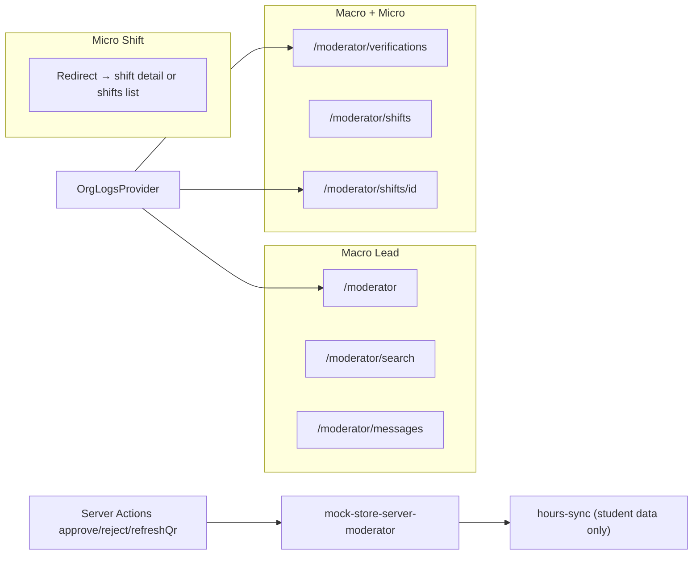
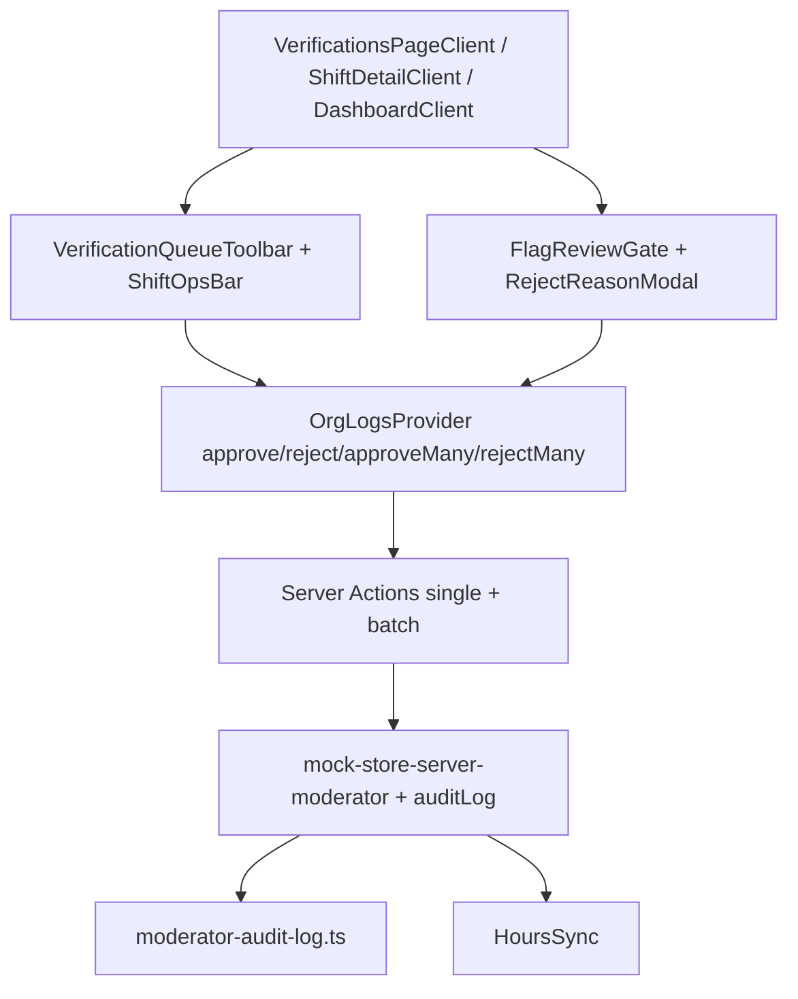

# Moderator Command Center Upgrade Plan

## Current architecture (baseline)

Both moderator personas share one route tree under [`apps/web/app/(moderator)/moderator/`](apps/web/app/(moderator)/moderator/), with access split by `session.access`:

**State today:** React Context ([`org-logs-provider.tsx`](apps/web/components/moderator/org-logs-provider.tsx)) + `localStorage` overlay ([`org-logs-store.ts`](apps/web/lib/org-logs-store.ts)) + in-memory server mutations. **No tRPC, no audit trail, no bulk APIs.**

**Explicit constraint:** Zero changes to student routes/components. [`hours-sync.ts`](apps/web/lib/hours-sync.ts) may continue receiving decision payloads — no student UI edits.

---

## Diagnosis

### 1. Friction points (repetitive clicks / view-leaving)

| Location | Issue |
|---|---|
| [`verification-row.tsx`](apps/web/components/moderator/verification-row.tsx) | Entire row is a `<Link>`; reject requires navigating to detail. Approve is inline but flagged items have no inline reject. |
| [`dashboard-client.tsx`](apps/web/components/moderator/dashboard-client.tsx) | "Needs review" capped at 4 items; no reject; must leave for full queue. |
| [`verifications-page-client.tsx`](apps/web/components/moderator/verifications-page-client.tsx) | Full-page card list only; selecting a claim navigates away (no master-detail). No sort (oldest-first for SLA). |
| [`shift-detail-client.tsx`](apps/web/components/moderator/shift-detail-client.tsx) | Large QR hero pushes claims below fold on mobile — micro moderators toggle between QR and triage constantly. |
| Macro only | [`command-palette.tsx`](apps/web/components/moderator/command-palette.tsx) navigates but cannot approve/reject from queue. |
| Micro only | No dashboard; [`mobile-nav.tsx`](apps/web/components/moderator/mobile-nav.tsx) FAB goes to QR but pending count on Verify tab doesn't deep-link to filtered queue. |

### 2. Security & compliance gaps

| Gap | Risk |
|---|---|
| No decision audit metadata | `verifiedByModeratorId` on approve only; reject has no `rejectedBy` / `decidedAt`. No immutable audit log for district/FERPA review. |
| Flagged quick-approve without gate | [`verification-row.tsx`](apps/web/components/moderator/verification-row.tsx) allows one-click approve on fraud-held claims — manual error risk. |
| No bulk mitigation | Seeded fraud cluster (3 identical flagged claims in [`mock-data-moderator.ts`](apps/web/lib/mock-data-moderator.ts)) must be triaged one-by-one. |
| Dual-state desync | Server in-memory `orgLogs` + client `localStorage` overlay can disagree after server restart. |
| `orgId` not enforced on reads | [`mock-store-server-moderator.ts`](apps/web/lib/mock-store-server-moderator.ts) scopes by shift access only (acceptable for single-org mock, but needs seam for production). |
| Reject reason optional | [`rejectOrgLog`](apps/web/lib/mock-store-server-moderator.ts) defaults to `"Rejected by moderator."` — weak accountability. |

### 3. Interface denseness (scan speed)

- [`VerificationRow`](apps/web/components/moderator/verification-row.tsx): ~5-line card per claim (~150px+ height) — good for marketing, slow for 20+ claim triage.
- No `tabular-nums` / compact row variant despite hours being primary scan field.
- No sticky queue toolbar when scrolling long lists.
- Detail page ([`verification-detail.tsx`](apps/web/components/moderator/verification-detail.tsx)) is two equal columns — timeline is secondary during triage; claim actions should stay visible.

### 4. Strategic additions for Kora

- **Fraud-cluster tooling** aligns with product rule (3+ identical unverified hours / 10 min).
- **Audit trail** is prerequisite for B2B district sales ($5K–$10K licenses) and FERPA defensibility.
- **Master-detail triage** turns verifications into an ops console, not a CRUD app.
- **Micro shift-ops HUD** lets one person run QR + verify without page-hopping — core MVP workflow.

---

## Design constraints (skills)

From [`redesign-existing-projects`](.claude/skills/redesign-existing-projects/SKILL.md) + [`emil-design-eng`](.claude/skills/emil-design-eng/SKILL.md):

- Keep existing tokens: `rounded-card`, `shadow-card`, `rounded-pill`, `bg-surface`, `font-display`, `font-mono` for hours.
- Add `tabular-nums` on hour counts and queue counts.
- **No animations** on keyboard-initiated triage (100+ actions/day rule).
- Dense mode = tighter padding + single-line rows, not a new color system.
- Bulk toolbar: instant appearance, no stagger on selection.

| Before | After | Why |
|---|---|---|
| Card-only queue rows | `compact` row variant (48px target height) | Faster vertical scan |
| Navigate to detail for reject | Inline reject + split-pane on `lg+` | Cuts 2 clicks per rejection |
| One-click flagged approve | `FlagReviewGate` confirmation | Prevents accidental fraud override |
| No decision metadata | `decidedAt` + `decidedByModeratorId` on all terminal states | Audit-ready seam for Prisma |
| Per-row server round-trips for clusters | `approveLogs` / `rejectLogs` batch actions | High-throughput fraud mitigation |

---

## Implementation plan (incremental, no rewrites)

### Phase A — Data layer & accountability seam

**Goal:** Every decision is traceable; batch mutations exist; reject requires reason.

**Files to change:**

1. [`apps/web/lib/types/moderator.ts`](apps/web/lib/types/moderator.ts)
   - Add optional `decidedAt: string | null`, `rejectedByModeratorId?: string` on `OrgShiftLog`.
   - Add `ModeratorAuditEntry` type (`id`, `logId`, `action`, `moderatorId`, `timestamp`, `reason?`, `metadata?`).

2. [`apps/web/lib/mock-store-server-moderator.ts`](apps/web/lib/mock-store-server-moderator.ts)
   - On approve/reject: set `decidedAt`, `rejectedByModeratorId` (reject path).
   - **Require non-empty `reason` on reject** (throw if missing/blank).
   - Add `approveOrgLogs(session, logIds[])` and `rejectOrgLogs(session, logIds[], reason)` — loop with existing `assertShiftAccess`, single sync batch.
   - Append to new in-memory `auditLog: ModeratorAuditEntry[]` via helper.

3. **New** [`apps/web/lib/moderator-audit-log.ts`](apps/web/lib/moderator-audit-log.ts)
   - `recordAuditEntry()`, `getAuditEntriesForLog(logId)`, `getRecentAuditEntries(session, limit)`.

4. [`apps/web/app/(moderator)/moderator/verifications/actions.ts`](apps/web/app/(moderator)/moderator/verifications/actions.ts)
   - Add `approveLogs(logIds: string[])` and `rejectLogs(logIds: string[], reason: string)`.
   - Reuse existing `revalidateModeratorDecisionPaths` in a loop.

5. [`apps/web/components/moderator/org-logs-provider.tsx`](apps/web/components/moderator/org-logs-provider.tsx)
   - Expose `approveMany`, `rejectMany`; upsert all returned logs to localStorage overlay.

6. [`apps/web/lib/verifications.ts`](apps/web/lib/verifications.ts)
   - Add `sortOrgLogs(logs, mode: 'newest' | 'oldest' | 'hours-desc')`.
   - Add `groupFlaggedByReason(logs)` for fraud-cluster detection (group by `flagReason` + `shiftId` + `hours`).

**Out of scope for this phase:** Prisma migration — types mirror future `ShiftLog` audit table.

---

### Phase B — Queue command center (macro + micro shared)

**Goal:** High-throughput triage on [`verifications-page-client.tsx`](apps/web/components/moderator/verifications-page-client.tsx) without leaving the view.

**New components** (all under `apps/web/components/moderator/`):

| Component | Responsibility |
|---|---|
| `verification-queue-toolbar.tsx` | Sticky bar: selection count, "Approve selected", "Reject selected", sort dropdown, dense toggle |
| `verification-split-pane.tsx` | `lg+` master-detail: list left, embedded `VerificationDetail` right |
| `flag-review-gate.tsx` | Modal: shows `flagReason`, requires explicit "I reviewed this flag" before approve |
| `fraud-cluster-banner.tsx` | When tab=flagged and cluster detected, offers "Select cluster (N)" + bulk reject/approve |

**Files to modify:**

1. [`verification-row.tsx`](apps/web/components/moderator/verification-row.tsx)
   - Add props: `compact?: boolean`, `selectable?: boolean`, `selected?: boolean`, `onSelect?`, `onQuickReject?`, `active?: boolean` (split-pane highlight).
   - Split row: checkbox + content area (not full-card link); name/shift link becomes smaller target.
   - Add inline reject icon button (opens shared `RejectReasonModal`).
   - Flagged approve → calls parent `onApprove` which may open `FlagReviewGate` first.

2. [`verifications-page-client.tsx`](apps/web/components/moderator/verifications-page-client.tsx)
   - URL state: add `?selected=<logId>&density=compact&sort=oldest` alongside existing params.
   - Wire toolbar, split-pane, selection state (`useState<Set<string>>`).
   - Keyboard layer (page-local, no animation):
     - `j` / `k` — move selection
     - `a` — approve selected (with flag gate)
     - `r` — reject selected (opens modal)
     - `x` — toggle checkbox on focused row
     - `/` — focus search (only when not in input)
   - Default sort on pending/flagged: **oldest first** (SLA visibility).

3. [`verification-detail.tsx`](apps/web/components/moderator/verification-detail.tsx)
   - Add `embedded?: boolean` prop — hides back link, uses compact header when in split-pane.
   - Add "Decision record" subsection: `decidedAt`, moderator id, audit entries from `getAuditEntriesForLog` (passed as prop from server page).

4. [`apps/web/app/(moderator)/moderator/verifications/[logId]/page.tsx`](apps/web/app/(moderator)/moderator/verifications/[logId]/page.tsx)
   - Fetch audit entries server-side; pass to `VerificationDetail`.

---

### Phase C — Macro dashboard throughput

**Goal:** Lead moderator clears queue without always opening full verifications page.

**Files to modify:**

1. [`dashboard-client.tsx`](apps/web/components/moderator/dashboard-client.tsx)
   - Increase "Needs review" slice from 4 → 8 on `xl`, keep 4 on mobile.
   - Add inline reject (reuse `RejectReasonModal`) beside approve.
   - Flagged rows: approve goes through `FlagReviewGate`.
   - "View all" link appends `?sort=oldest` when pending > 0.

2. [`dashboard-next-action.tsx`](apps/web/components/moderator/dashboard-next-action.tsx)
   - When `flaggedCount >= 3`, CTA deep-links to `/moderator/verifications?status=flagged` with cluster banner auto-expanded.

---

### Phase D — Micro shift-ops HUD

**Goal:** Shift moderator runs QR + verification from one screen at event velocity.

**New component:** `shift-ops-bar.tsx`
- Sticky below topbar on shift detail: pending count for this shift, "Review pending" → `/moderator/verifications?shift=<id>&status=pending`, QR collapse toggle.
- Uses existing `useOrgLogs()` — no new data fetch.

**Files to modify:**

1. [`shift-detail-client.tsx`](apps/web/components/moderator/shift-detail-client.tsx)
   - Insert `ShiftOpsBar` above hero.
   - Make QR panel collapsible (default: expanded if upcoming + no pending; collapsed if pending > 0).
   - Filter claims section: default tab chip "Pending (N)" / "All" above `VerificationRow` list.
   - Pass `compact` to rows on mobile.

2. [`mobile-nav.tsx`](apps/web/components/moderator/mobile-nav.tsx)
   - Tapping Verify when `pendingCount > 0` navigates to `/moderator/verifications?status=pending&sort=oldest` (micro gets shift-scoped data automatically).

3. [`apps/web/app/(moderator)/moderator/error.tsx`](apps/web/app/(moderator)/moderator/error.tsx) + [`not-found.tsx`](apps/web/app/(moderator)/moderator/not-found.tsx)
   - Replace hardcoded `/moderator` home link with session-aware fallback using `getModeratorHomePath(session)` from [`policy.ts`](apps/web/lib/auth/policy.ts) — micro-safe recovery.

---

### Phase E — State reliability (minimal fix)

**Goal:** Reduce localStorage/server desync without replacing mock architecture.

1. [`org-logs-provider.tsx`](apps/web/components/moderator/org-logs-provider.tsx)
   - On mount, reconcile: if server `initialLogs` status differs from overlay for same `id`, prefer **server** (server wins on conflict).
   - Add `lastSyncedAt` ref; expose optional manual "Refresh queue" that calls `router.refresh()`.

2. [`verifications-page-client.tsx`](apps/web/components/moderator/verifications-page-client.tsx)
   - Add subtle "Refresh" icon button in toolbar → `router.refresh()` (no full page reload).

---

## Architecture after upgrade

---

## Testing & verification

- Extend [`apps/web/lib/auth/__tests__/scope.test.ts`](apps/web/lib/auth/__tests__/scope.test.ts) — no changes expected.
- **New unit tests:**
  - `lib/verifications.test.ts` — sort, cluster grouping, filter + sort combo.
  - `lib/moderator-audit-log.test.ts` — entry recording.
  - `mock-store-server-moderator` batch approve/reject with micro session scoping.
- **Manual QA matrix:**

| Persona | Flow |
|---|---|
| Macro (Elena) | Split-pane triage, bulk reject fraud cluster, keyboard `j/k/a/r`, dashboard inline reject |
| Micro (Dana) | Shift ops bar, collapsed QR with pending claims, verifications scoped to Riverside shift only |
| Security | Micro cannot batch-approve out-of-scope log IDs (server throws); flagged approve shows gate |

Run: `npm run build` from monorepo root; spot-check `apps/web` moderator routes in dev.

---

## Explicitly out of scope

- Student portal UI or routes
- tRPC / Prisma / Clerk migration (types and audit seam only)
- Real-time fraud engine (cluster UI works on existing `flagReason` seed data)
- New macro routes (search/messages/profile unchanged)
- Visual rebrand — token-level consistency only

---

## File touch summary

| Action | Paths |
|---|---|
| **New** | `verification-queue-toolbar.tsx`, `verification-split-pane.tsx`, `flag-review-gate.tsx`, `fraud-cluster-banner.tsx`, `shift-ops-bar.tsx`, `moderator-audit-log.ts`, `verifications.test.ts` |
| **Modify** | `verification-row.tsx`, `verifications-page-client.tsx`, `verification-detail.tsx`, `dashboard-client.tsx`, `shift-detail-client.tsx`, `org-logs-provider.tsx`, `org-logs-store.ts`, `types/moderator.ts`, `verifications.ts`, `mock-store-server-moderator.ts`, `verifications/actions.ts`, `mobile-nav.tsx`, `error.tsx`, `not-found.tsx`, `verifications/[logId]/page.tsx` |
| **Do not touch** | `apps/web/app/(student)/**`, `apps/web/components/student/**` (except existing shared `toast-provider` imports) |
