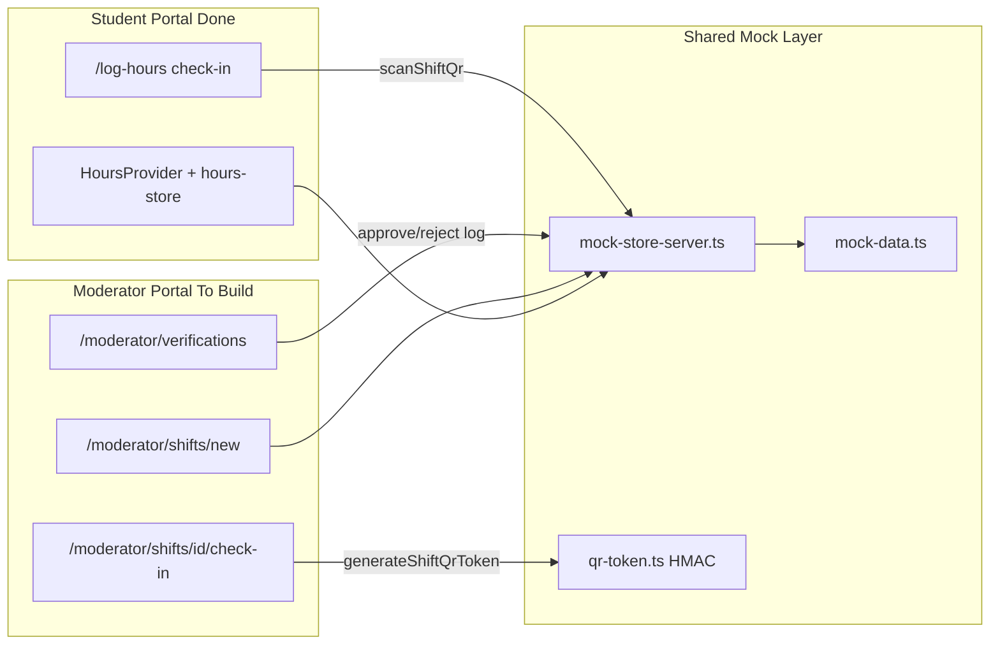

# Moderator Portal Build Prompt for Claude Code Fable

## Context

The student portal is complete under [`apps/web/app/(student)/`](apps/web/app/(student)/) with 55+ components, shared providers, and a mock data layer. **No moderator routes exist yet.** You chose:

- **Scope:** Full mock MVP (dashboard, shifts, QR check-in, verification queue, roster, messages, profile)
- **QR flow:** Match the **current student implementation** — moderator **displays** a shift-bound HMAC token; student scans at `/log-hours#check-in`. Ignore the inverted flow in [`docs/architecture.md`](docs/architecture.md) for now.

Moderator portal must live at a **URL prefix** (`/moderator/*`) because student routes already occupy `/`, `/events`, etc.

---

## Copy-paste prompt (give this to Claude Code Fable)

```markdown
# Build Kora Org Moderator Portal (Mock MVP)

You are building the **org moderator portal frontend** for Kora in `apps/web`. The **student portal is done** — your job is to create a parallel portal that uses the **same design language, file conventions, and mock-layer architecture**. Do NOT wire tRPC, Clerk, or Prisma yet.

## Read first (mandatory)

1. `CLAUDE.md` — project constraints (FERPA, verified hours, no inline state rules)
2. `docs/superpowers/plans/2026-06-11-student-frontend-completion.md` — student patterns to mirror
3. `apps/web/app/(student)/layout.tsx` — shell wiring
4. `apps/web/components/student/student-shell.tsx`, `page-shell.tsx`, `page-header.tsx`, `sidebar.tsx`, `sidebar-nav.tsx`, `topbar.tsx`, `mobile-nav.tsx`, `toast-provider.tsx`
5. `apps/web/lib/mock-store-server.ts` + `apps/web/lib/qr-token.ts` — existing QR/session state
6. `apps/web/lib/mock-data.ts` — seed shifts, orgs, `orgModerators`, `orgModeratorIds`, pending/flagged logs
7. `apps/web/app/globals.css` — design tokens (reuse as-is, do not fork)

## Hard constraints

- **Route prefix:** All moderator pages under `/moderator/*` via `app/(moderator)/moderator/` (route group avoids layout clash with `(student)`)
- **Same visual system:** `bg-canvas`, `rounded-card`, `shadow-card`, `font-display` headings, `font-mono` labels, Lucide `strokeWidth={2.2}`, `stagger` page enter, `max-w-shell`
- **Same component split:** Server `page.tsx` + client `*-page-client.tsx`; colocated `actions.ts` for mutations
- **Same providers pattern:** `ModeratorShell` at layout with `ToastProvider` + domain provider(s)
- **Mock only:** Extend server store in `lib/mock-store-server-moderator.ts` (or extend existing server store carefully) — no new API routes bypassing future tRPC
- **Logged-in persona:** Default mock moderator = **Elena Vasquez** (`mod_parks`) at **City Parks & Recreation** (`org_city_parks`). Scope all data to her org's shifts/logs.
- **QR flow (locked):** Moderator **displays** rotating shift QR; student scans (already built). Reuse `generateShiftQrToken` / `getShiftQrSessions` from existing server store. Moderator UI must: show QR large on mobile, countdown to expiry (15 min), refresh button, copy token fallback.
- **Verification:** Seed data has `pending` and `flagged` logs. Moderator can approve (set `verifiedAt`, `verifiedByModeratorId`) or reject. Only `verified` hours count (see `lib/progress.ts`).
- **Do not commit** unless I explicitly ask.
- **Verify after each phase:**
  ```bash
  cd apps/web && npm run check-types && npm run lint && npm run build
  ```

## Architecture to replicate

```
(moderator)/moderator/layout.tsx (server)
  └─ ModeratorShell (client: ToastProvider + ModeratorProvider)
       └─ min-h-screen bg-canvas max-w-shell flex
            ├─ ModeratorSidebar (desktop lg+)
            ├─ ModeratorPageShell (per page: Topbar + main)
            ├─ ModeratorMobileNav (lg:hidden, fixed bottom)
            └─ ModeratorCommandPalette (optional but preferred for parity)
```

Mirror student file naming under `components/moderator/` and `lib/` domain helpers.

## Pages & routes (full MVP)

| Route | Purpose |
|-------|---------|
| `/moderator` | Dashboard: today's shifts, pending count, quick "Start check-in", recent verifications |
| `/moderator/shifts` | Shift list for org — upcoming / past tabs, filters |
| `/moderator/shifts/new` | Shift builder (title, date/time, duration, slots, skills tags, category, waiver text, image) |
| `/moderator/shifts/[shiftId]` | Shift detail: roster (committed students), edit, "Display check-in QR" CTA |
| `/moderator/shifts/[shiftId]/check-in` | Full-screen QR display (mobile-first), expiry timer, regenerate |
| `/moderator/verifications` | Queue: pending + flagged tabs, bulk-friendly list, approve/reject actions |
| `/moderator/verifications/[logId]` | Log detail: student info, shift, timeline (mirror `hour-log-detail.tsx`), approve/reject |
| `/moderator/roster` | All committed students across upcoming shifts |
| `/moderator/messages` | Moderator-side threads (reuse/extend `mock-messages-store.ts` pattern, filter `kind: "moderator"`) |
| `/moderator/profile` | Moderator profile + org info + settings (logout → toast "Sign-in coming soon") |
| `/moderator/search?q=` | Unified search: shifts, students, pending logs |
| `/moderator/loading.tsx`, `/moderator/not-found.tsx` | Branded skeleton + 404 inside shell |

## Navigation IA

**Desktop sidebar + mobile bottom nav** (same interaction model as student):

- Dashboard (`/moderator`)
- Shifts
- Verifications (badge = pending count) — **center primary CTA on mobile** (like student's "Log Hours")
- Roster
- More sheet: Messages, Profile, Search

Hotkey hints on desktop nav items (g+d, g+s, etc.) matching student pattern.

## Data layer (create/extend)

| File | Responsibility |
|------|----------------|
| `lib/types/moderator.ts` | `ModeratorProfile`, verification actions, shift form types (extend shared types where possible) |
| `lib/moderator-data.ts` | Mock logged-in moderator, org helpers, `getModeratorOrg()`, `getOrgShifts()` |
| `lib/mock-store-server-moderator.ts` | Server mutations: create/edit shift, approve/reject log, regenerate QR session, get org-scoped logs |
| `lib/verifications.ts` | Pure getters: pending queue, flagged queue, filters, timeline (mirror `lib/hours.ts`) |
| `lib/shift-form.ts` | Validation + defaults for shift builder |
| `components/moderator/moderator-provider.tsx` | Context: pending count, refresh, org scope |
| `app/(moderator)/moderator/*/actions.ts` | Server actions wrapping server store |

**Shared seed:** Reuse existing `shifts`, `hoursLog`, `organizations` from `mock-data.ts`. Filter by `org_city_parks` (Elena's org). Add new shifts/logs via server store so student portal can eventually see them.

## Key UI components to build

**Shell:** `moderator-shell`, `moderator-sidebar`, `moderator-sidebar-nav`, `moderator-topbar`, `moderator-mobile-nav`, `moderator-mobile-more-sheet`, `moderator-page-shell`, `moderator-page-header`, `moderator-command-palette`

**Dashboard:** `moderator-dashboard-next-action`, `moderator-stats-row` (pending count, verifications this week, upcoming shifts), `upcoming-shifts-carousel`, `recent-verifications-table`

**Shifts:** `shifts-page-client`, `shift-card` (moderator variant), `shift-form-client`, `shift-detail-client`, `shift-roster-table`, `shift-detail-hero`

**Check-in:** `check-in-display.tsx` — large QR (use a QR library or styled token display), expiry countdown, regenerate, "Students scan this at Log Hours"

**Verifications:** `verifications-page-client`, `verification-row`, `verification-detail` (approve/reject with toast feedback), status chips using `text-pending` / `text-flagged` / `text-success`

**Shared UX:** Reuse toast pattern from student. Student row component showing avatar + name + grade. Empty states with clear CTAs.

## Cross-portal consistency checks

After building, manually verify:

1. Moderator generates QR on `/moderator/shifts/[id]/check-in` → copy demo token → student `/log-hours#check-in` scan still works (`scanShiftQr` in server store)
2. Moderator approves a pending log → if student hours store reads same server logs, counts update (may require extending `getAllHoursLogs()` merge)
3. Mobile nav: Verifications one tap from bottom bar
4. All pages use same card/button/chip classes as student portal
5. `check-types && lint && build` pass

## Implementation phases

**Phase 1 — Scaffold:** Route group, layout, shell components, providers, loading/not-found, empty dashboard

**Phase 2 — Shifts:** List, detail, shift builder, roster on detail page

**Phase 3 — Check-in QR:** Display screen wired to `generateShiftQrToken` + server sessions

**Phase 4 — Verifications:** Queue + detail + approve/reject server actions

**Phase 5 — Dashboard polish:** Stats, next-action card, recent activity

**Phase 6 — Messages, profile, search:** Parity with student secondary pages

**Phase 7 — Mobile nav + command palette + cross-linking**

**Phase 8 — A11y pass:** aria labels, alt text, reduced-motion respect (already global)

## Do NOT

- Add Clerk auth or role middleware yet
- Create Next.js API routes outside Server Actions
- Hardcode FL/WA hour thresholds in UI
- Use shadcn — student portal uses local Tailwind components
- Change student routes or break existing student flows
- Implement the inverted QR flow from architecture.md (student displays, moderator scans)

## Root layout note

Update `apps/web/app/layout.tsx` metadata to a neutral title ("Kora") OR set per-segment metadata in moderator layout ("Kora — Org Portal"). Student metadata can stay on student layout override.

Start with Phase 1. Read the student files listed above before writing any code. Match their code style exactly.
```

---

## Why this prompt is structured this way



## Reference files to cite during build

| Pattern | Student reference | Moderator equivalent |
|---------|-------------------|-------------------|
| Layout shell | [`student-shell.tsx`](apps/web/components/student/student-shell.tsx) | `moderator-shell.tsx` |
| Page wrapper | [`page-shell.tsx`](apps/web/components/student/page-shell.tsx) | `moderator-page-shell.tsx` |
| Server actions | [`scan/actions.ts`](apps/web/app/(student)/scan/actions.ts) | `(moderator)/moderator/verifications/actions.ts` |
| Detail page | [`hours/[logId]/page.tsx`](apps/web/app/(student)/hours/[logId]/page.tsx) | `verifications/[logId]/page.tsx` |
| Page client | [`events-page-client.tsx`](apps/web/components/student/events-page-client.tsx) | `shifts-page-client.tsx` |
| QR server logic | [`mock-store-server.ts`](apps/web/lib/mock-store-server.ts) | extend, don't rewrite |
| Status/timeline | [`hours.ts`](apps/web/lib/hours.ts) | `verifications.ts` |

## Optional additions to the prompt

If you want Fable to also produce a session checkpoint, append:

> After completing all phases, write `docs/superpowers/checkpoints/2026-06-11-moderator-portal.md` with routes built, decisions made, and manual test results. Do not commit.
