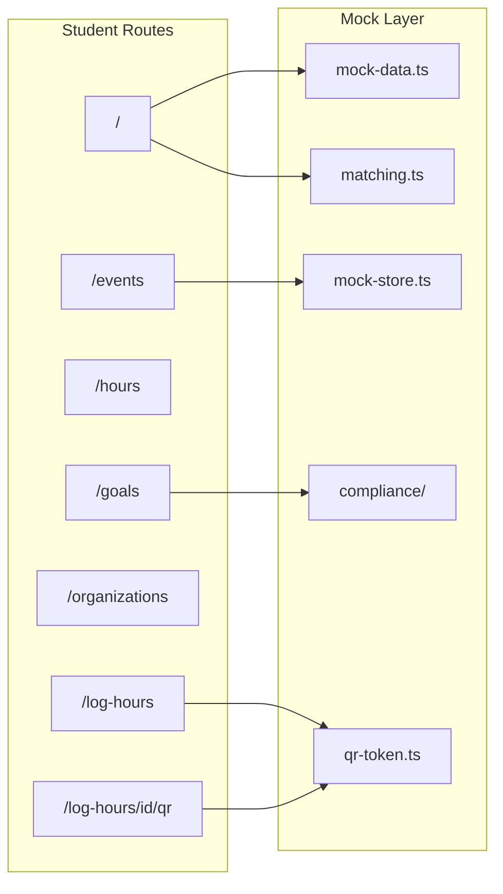
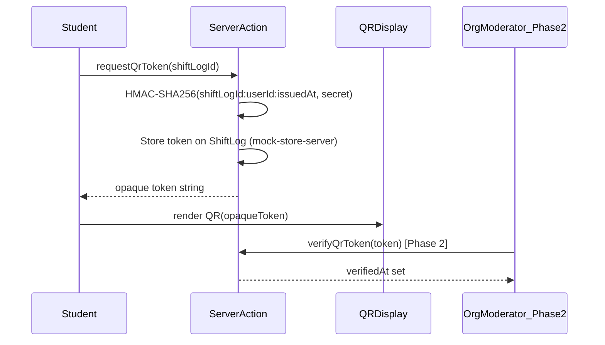

# Student Portal Completion Plan

> **For agentic workers:** REQUIRED SUB-SKILL: Use superpowers:subagent-driven-development (recommended) or superpowers:executing-plans to implement this plan task-by-task.

**Goal:** Finish the student portal — all nav routes, QR generation, "For You" matching, and a realistic mock data layer — building on the existing dashboard at [`apps/web/app/(student)/page.tsx`](apps/web/app/(student)/page.tsx).

**Architecture:** Keep the current pattern: server components by default, client components only for interactive state (filters, saves, follow toggles). Centralize types and seed data in `lib/`, add a thin `lib/mock-store.ts` to simulate commits and QR issuance until tRPC replaces it. Compliance thresholds live in a JSON rules config (not inline). HMAC signing stays server-side via Server Actions; QR encodes only the opaque signed token, never raw IDs.

**Tech stack:** Next.js 16 App Router, TypeScript, Tailwind v4 (`globals.css` tokens), `lucide-react`, `qrcode` (server QR generation), `server-only`.

**Plan status:** ✅ **Complete** (2026-06-05) — all phases done, `check-types` + `lint` + `build` pass. Changes uncommitted.

---

## Progress

- [x] **Phase 1** — Foundation (types, rules engine, matching, mock data, mock store)
- [x] **Phase 2** — Shared layout + navigation (PageShell, SidebarNav, dashboard refactor)
- [x] **Phase 3** — Sub-routes (`/events`, `/hours`, `/goals`, `/organizations`)
- [x] **Phase 4** — QR flow (`/log-hours`, HMAC tokens, qr display)
- [x] **Phase 5** — Cross-linking (topbar search deferred as optional)
- [x] **Phase 6** — Verification (`check-types`, `lint`, `build`)

| Todo | Status |
|------|--------|
| foundation-types-rules | ✅ |
| matching-mock-store | ✅ |
| layout-nav-shell | ✅ |
| dashboard-refactor | ✅ |
| page-events | ✅ |
| page-hours | ✅ |
| page-goals | ✅ |
| page-organizations | ✅ |
| qr-flow | ✅ |
| verify-build | ✅ |

---

## Current State (post-implementation)

| Area | Status |
|------|--------|
| Dashboard UI at `/` | ✅ PageShell + Hero + CategoryCards + ShiftsCarousel + HoursTable + RightRail |
| Design tokens | ✅ [`globals.css`](apps/web/app/globals.css) — Kora cyan palette |
| Mock data | ✅ 8 shifts, 12 hours, 8 orgs, 3 completedShiftLogs — [`lib/mock-data.ts`](apps/web/lib/mock-data.ts) |
| Nav routes | ✅ `/events`, `/hours`, `/goals`, `/organizations` all built |
| QR flow | ✅ Student displays QR at `/log-hours/[id]/qr`; `/scan` redirects to `/log-hours` |
| Matching | ✅ Skill overlap in `lib/matching.ts`; "For You" shows top 4 ranked shifts |
| Rules engine | ✅ `lib/compliance/` — FL Bright Futures + graduation (not hardcoded) |
| tRPC / DB / Clerk | ⏳ Out of scope — next PR |



---

## Phase 1 — Foundation (types, rules, matching, expanded mock data)

### Step 1.1: Create shared types

**Create:** [`apps/web/lib/types/student.ts`](apps/web/lib/types/student.ts)

Define typed interfaces aligned with Prisma schema and UI needs:

```typescript
export type CategoryKey = "community" | "environment" | "education";
export type TintKey = "lavender" | "pink" | "sky";
export type LogStatus = "verified" | "pending" | "flagged";

export interface StudentProfile {
  id: string;
  name: string;
  firstName: string;
  grade: string;
  avatar: string;
  schoolId: string;
  schoolState: string;       // "FL" | "WA" etc.
  skills: string[];
  hoursLogged: number;
  streakWeeks: number;
}

export interface Shift {
  id: string;
  title: string;
  description: string;
  org: string;
  orgId: string;
  category: string;
  categoryKey: CategoryKey;
  categoryTint: TintKey;
  date: string;              // display string
  scheduledAt: string;       // ISO for sorting
  spotsLeft: number;
  slots: number;
  hours: number;
  img: string;
  saved: boolean;
  skills: string[];
  committed: boolean;
}

export interface ShiftLog {
  id: string;
  shiftId: string;
  org: string;
  date: string;
  category: string;
  categoryKey: CategoryKey;
  categoryTint: TintKey;
  activity: string;
  hours: number;
  status: LogStatus;
  avatar: string;
  qrToken: string | null;
  verifiedAt: string | null;
  completedAt: string;       // when shift ended — gates QR request
}

export interface Organization {
  id: string;
  name: string;
  description: string;
  categories: CategoryKey[];
  distance: string;
  verified: boolean;
  avatar: string;
  following: boolean;
  upcomingShifts: number;
}
```

**Modify:** [`apps/web/lib/mock-data.ts`](apps/web/lib/mock-data.ts)
- Re-export types from `types/student.ts` (remove inline type aliases)
- Change numeric `id` fields to string cuid-style IDs (`"shift_riverside_cleanup"`, etc.)
- Add `student.skills`, `student.schoolState: "FL"`, `student.schoolId`
- Expand `shifts` to **8 items** with varied `skills[]` and `committed` flags
- Expand `hoursLog` to **12 items** spanning all statuses and categories
- Expand `organizations` to **8 verified orgs** with `description`, `categories`, `verified: true`, `upcomingShifts`
- Add `committedShifts: string[]` (IDs student has signed up for)
- Add `completedShiftLogs: ShiftLog[]` — 3 entries where `completedAt` is in the past, `qrToken` is null (ready for QR generation), `status: "pending"`

### Step 1.2: Compliance rules engine

**Create:** [`apps/web/lib/compliance/rules.json`](apps/web/lib/compliance/rules.json)

```json
{
  "FL": {
    "graduation": { "default": 40 },
    "brightFutures": { "gold": 100, "silver": 75 },
    "categories": {
      "community": 15,
      "environment": 15,
      "education": 10
    }
  },
  "WA": {
    "graduation": { "default": 40 },
    "categories": {
      "community": 15,
      "environment": 15,
      "education": 10
    }
  }
}
```

**Create:** [`apps/web/lib/compliance/index.ts`](apps/web/lib/compliance/index.ts)

```typescript
import rules from "./rules.json";

export type StateCode = keyof typeof rules;

export function getGraduationRequirement(state: StateCode): number { ... }
export function getBrightFuturesTiers(state: StateCode): { gold: number; silver: number } | null { ... }
export function getCategoryGoals(state: StateCode): Record<CategoryKey, number> { ... }
export function getVerifiedHours(logs: ShiftLog[]): number { ... }  // only status === "verified"
```

**Modify:** [`apps/web/components/student/hero.tsx`](apps/web/components/student/hero.tsx)
- Replace hardcoded `hoursRequired`, `brightFuturesGold/Silver` with `getGraduationRequirement(student.schoolState)` and `getBrightFuturesTiers()`
- Dynamic subtitle: `"FL Bright Futures · Graduation Service Requirement"` only when `getBrightFuturesTiers()` returns non-null; otherwise `"Graduation Service Requirement"`

**Modify:** [`apps/web/components/student/progress-ring.tsx`](apps/web/components/student/progress-ring.tsx) and [`category-cards.tsx`](apps/web/components/student/category-cards.tsx)
- Accept optional `hoursLogged` / `hoursRequired` props; default to rules-engine values from `student.schoolState`

### Step 1.3: Skill matching utility

**Create:** [`apps/web/lib/matching.ts`](apps/web/lib/matching.ts)

```typescript
export function matchScore(studentSkills: string[], shiftSkills: string[]): number {
  if (shiftSkills.length === 0) return 0;
  const overlap = studentSkills.filter((s) => shiftSkills.includes(s)).length;
  return overlap / shiftSkills.length;  // 0–1 normalized score
}

export function rankShiftsForStudent<T extends { skills: string[]; scheduledAt: string }>(
  studentSkills: string[],
  shifts: T[],
): (T & { matchScore: number })[] {
  return shifts
    .map((s) => ({ ...s, matchScore: matchScore(studentSkills, s.skills) }))
    .sort((a, b) => b.matchScore - a.matchScore || a.scheduledAt.localeCompare(b.scheduledAt));
}
```

MVP matching is **tag overlap**, not the Phase 3 AI engine. Document this in a one-line comment referencing `services/matching-engine`.

### Step 1.4: Mock store (simulated server state)

**Create:** [`apps/web/lib/mock-store.ts`](apps/web/lib/mock-store.ts)

In-memory + `localStorage` persistence for client-side mutations until tRPC:

```typescript
"use client";
// commitToShift(shiftId): adds to committedShifts, decrements spotsLeft
// isCommitted(shiftId): boolean
// getCommittedShifts(): Shift[]
// toggleSavedShift(shiftId): boolean
// toggleFollowOrg(orgId): boolean
```

Seed from `mock-data.ts` on first load. Export hooks: `useMockStore()` wrapping React state + localStorage sync.

**Create:** [`apps/web/lib/mock-store-server.ts`](apps/web/lib/mock-store-server.ts)

Server-readable copy of completed shift logs for QR page (imports from `mock-data.ts` `completedShiftLogs`). Later replaced by `packages/db` queries.

---

## Phase 2 — Shared layout and navigation fixes

### Step 2.1: Active nav state

**Create:** [`apps/web/components/student/sidebar-nav.tsx`](apps/web/components/student/sidebar-nav.tsx) (`"use client"`)

- `usePathname()` to set `active` per nav item
- Nav items: `Dashboard → /`, `Events → /events`, `My Hours → /hours`, `Goals → /goals`, `Organizations → /organizations`

**Modify:** [`apps/web/components/student/sidebar.tsx`](apps/web/components/student/sidebar.tsx)
- Replace static `nav` array + hardcoded `active: true` with `<SidebarNav />`

### Step 2.2: Reusable page shell

**Create:** [`apps/web/components/student/page-shell.tsx`](apps/web/components/student/page-shell.tsx)

```typescript
interface PageShellProps {
  children: React.ReactNode;
  showRightRail?: boolean;  // default false for sub-pages
}
```

Wraps `Topbar` + `<main>` + optional `RightRail`. Dashboard keeps `showRightRail={true}`.

**Create:** [`apps/web/components/student/page-header.tsx`](apps/web/components/student/page-header.tsx)

Title + optional description + optional action slot (used on all sub-pages).

### Step 2.3: Refactor dashboard page

**Modify:** [`apps/web/app/(student)/page.tsx`](apps/web/app/(student)/page.tsx)

```typescript
export default function StudentDashboardPage() {
  return (
    <PageShell showRightRail>
      <Hero />
      <CategoryCards />
      <ShiftsCarousel />
      <HoursTable />
    </PageShell>
  );
}
```

**Modify:** [`apps/web/components/student/shifts-carousel.tsx`](apps/web/components/student/shifts-carousel.tsx)
- Import `rankShiftsForStudent` + `student` skills
- Show top 4 matched shifts (not all 8)
- Display match badge when `matchScore > 0`: `"3/4 skills match"` chip on card
- Add "See all" link to `/events`

**Modify:** [`apps/web/components/student/right-rail.tsx`](apps/web/components/student/right-rail.tsx)
- "See All" button → `Link href="/organizations"`

---

## Phase 3 — Sub-routes and pages

### Step 3.1: Events — browse and commit to shifts

**Create:** [`apps/web/components/student/shift-card.tsx`](apps/web/components/student/shift-card.tsx)
- Extract card UI from `shifts-carousel.tsx` (image, category chip, heart save, org, spots)
- Props: `shift`, `onSave`, `onCommit`, `isSaved`, `isCommitted`, `matchScore?`
- "Commit" button: primary pill, disabled when `spotsLeft === 0` or already committed

**Create:** [`apps/web/components/student/shift-filters.tsx`](apps/web/components/student/shift-filters.tsx) (`"use client"`)
- Filter chips: All / Community / Environment / Education
- Skill filter dropdown from union of all shift skills
- Search input (title + org name)

**Create:** [`apps/web/app/(student)/events/page.tsx`](apps/web/app/(student)/events/page.tsx)

```typescript
// PageShell + PageHeader("Events Near You", "Browse and commit to volunteer shifts")
// ShiftFilters + responsive grid of ShiftCard (2-col md, 3-col lg)
// Client wrapper EventsPageClient uses useMockStore for commit/save
// Sort: matchScore desc (rankShiftsForStudent), then date asc
```

### Step 3.2: Hours — full ledger with filters

**Create:** [`apps/web/components/student/hours-filters.tsx`](apps/web/components/student/hours-filters.tsx) (`"use client"`)
- Status tabs: All / Verified / Pending / Flagged
- Category chips: All + three categories
- Sort: Newest / Oldest / Most hours

**Create:** [`apps/web/components/student/hours-ledger.tsx`](apps/web/components/student/hours-ledger.tsx)
- Full-width table (same columns as `hours-table.tsx` plus optional QR link column)
- For `pending` rows with `completedAt` in past: link "Get QR" → `/log-hours/{id}/qr`
- Mobile: stack rows as cards below `lg` breakpoint

**Create:** [`apps/web/app/(student)/hours/page.tsx`](apps/web/app/(student)/hours/page.tsx)

```typescript
// PageShell + PageHeader("My Hours", "Full service hour ledger")
// Summary chips: total verified / pending / flagged counts (computed from hoursLog)
// HoursFilters + HoursLedger
```

**Modify:** [`apps/web/components/student/hours-table.tsx`](apps/web/components/student/hours-table.tsx)
- Slice to first 4 rows only (dashboard preview); link "See all" already points to `/hours`

### Step 3.3: Goals — state requirement progress

**Create:** [`apps/web/components/student/requirement-card.tsx`](apps/web/components/student/requirement-card.tsx)
- Reusable progress card: label, logged/required, pct bar, status chip (On track / Behind / Complete)

**Create:** [`apps/web/components/student/goals-overview.tsx`](apps/web/components/student/goals-overview.tsx)
- Graduation requirement card (from `getGraduationRequirement`)
- FL-only: Bright Futures Gold + Silver cards (from `getBrightFuturesTiers`)
- Category breakdown grid (3 cards using `getCategoryGoals` + verified hours per category)
- Uses `getVerifiedHours()` — only verified hours count per CLAUDE.md constraint

**Create:** [`apps/web/app/(student)/goals/page.tsx`](apps/web/app/(student)/goals/page.tsx)

```typescript
// PageShell + PageHeader("Goals", "Progress toward graduation and scholarship requirements")
// GoalsOverview
// Optional: large ProgressRing centered at top
```

### Step 3.4: Organizations — browse verified orgs

**Create:** [`apps/web/components/student/org-card.tsx`](apps/web/components/student/org-card.tsx)
- Avatar, name, description, category chips, distance, upcoming shifts count
- Verified badge (shield icon) when `verified === true`
- Follow / Following toggle

**Create:** [`apps/web/app/(student)/organizations/page.tsx`](apps/web/app/(student)/organizations/page.tsx)

```typescript
// PageShell + PageHeader("Organizations", "Verified community partners")
// Search filter (name + description)
// Category filter chips
// Grid of OrgCard (filter: verified === true only)
// useMockStore for follow toggles
```

---

## Phase 4 — QR code generation flow

### Architecture (corrected from current `/scan` page)



**Key constraint:** QR payload is **only** the signed token string (e.g. `kora.v1.<base64url-signature>`). No `shiftId`, `userId`, or timestamps in the QR content.

### Step 4.1: HMAC token library (server-only)

**Create:** [`apps/web/lib/qr-token.ts`](apps/web/lib/qr-token.ts)

```typescript
import "server-only";
import { createHmac, randomBytes } from "crypto";

const TOKEN_TTL_MS = 15 * 60 * 1000;  // 15 min expiry

export function generateQrToken(shiftLogId: string, userId: string): {
  token: string;       // "kora.v1.<sig>"
  expiresAt: Date;
} {
  const issuedAt = Date.now();
  const payload = `${shiftLogId}:${userId}:${issuedAt}`;
  const sig = createHmac("sha256", process.env.QR_HMAC_SECRET ?? "dev-secret")
    .update(payload).digest("base64url");
  return { token: `kora.v1.${sig}`, expiresAt: new Date(issuedAt + TOKEN_TTL_MS) };
}

export function verifyQrToken(token: string, shiftLogId: string, userId: string, issuedAt: number): boolean { ... }
```

Add `import "server-only"` to prevent client bundling. Dev fallback secret for local mock; production requires `QR_HMAC_SECRET` from [`.env.example`](.env.example).

### Step 4.2: Server Action for token issuance

**Create:** [`apps/web/app/(student)/log-hours/actions.ts`](apps/web/app/(student)/log-hours/actions.ts)

```typescript
"use server";
export async function requestQrToken(shiftLogId: string): Promise<{
  token: string;
  expiresAt: string;
  shiftTitle: string;
  org: string;
  hours: number;
}> {
  // 1. Look up shiftLog in mock-store-server
  // 2. Guard: must be completed (completedAt < now), no existing qrToken, status pending
  // 3. Call generateQrToken(shiftLogId, student.id)
  // 4. Persist token on mock shiftLog
  // 5. Return token + display metadata
}
```

### Step 4.3: QR display component

**Add dependency:** `qrcode` to [`apps/web/package.json`](apps/web/package.json)

**Create:** [`apps/web/components/student/qr-display.tsx`](apps/web/components/student/qr-display.tsx) (`"use client"`)
- Receives `token`, `expiresAt`, shift metadata
- Renders QR image via data URL from server-passed `qrDataUrl` (generated server-side with `qrcode.toDataURL(token)`)
- Countdown timer to expiry
- Instructions: "Show this code to your organization moderator"
- "Done" link back to `/hours`

### Step 4.4: Log-hours pages

**Create:** [`apps/web/app/(student)/log-hours/page.tsx`](apps/web/app/(student)/log-hours/page.tsx)
- Lists completed shifts awaiting verification (from `completedShiftLogs`)
- Each row: org, date, hours, status, "Generate QR" button
- Button calls `requestQrToken` then navigates to QR page

**Create:** [`apps/web/app/(student)/log-hours/[shiftLogId]/qr/page.tsx`](apps/web/app/(student)/log-hours/[shiftLogId]/qr/page.tsx)
- Server component: if token already exists, render QR; else show "Generate QR" client button calling action
- On success: render `QrDisplay` with `qrcode.toDataURL(token, { width: 280 })`

**Modify:** [`apps/web/components/student/hero.tsx`](apps/web/components/student/hero.tsx)
- Change "Log Hours" link from `/scan` → `/log-hours`

**Modify:** [`apps/web/app/(student)/scan/page.tsx`](apps/web/app/(student)/scan/page.tsx)
- Replace body with `redirect("/log-hours")` — org-side scanning is Phase 2 (org portal)

---

## Phase 5 — Cross-linking and polish

| From | To | Change |
|------|----|--------|
| Hero "Find Events" | `/events` | Already linked |
| Hero "Log Hours" | `/log-hours` | Update href |
| ShiftsCarousel | `/events` | Add "See all" |
| HoursTable | `/hours` | Already linked |
| RightRail | `/organizations` | Add Link |
| HoursLedger pending rows | `/log-hours/{id}/qr` | New |
| Sidebar nav | all routes | Active state via pathname |
| Events ShiftCard | mock-store commit | New |

**Modify:** [`apps/web/components/student/topbar.tsx`](apps/web/components/student/topbar.tsx)
- Wire search input to pass `?q=` query param on sub-pages (optional lightweight filter; can be deferred to a `"use client"` wrapper if time-constrained)

---

## Phase 6 — Verification

Run from repo root:

```bash
cd apps/web && npm run check-types
cd apps/web && npm run lint
cd apps/web && npm run build
npm run dev   # manual smoke test all routes
```

**Manual test checklist:**
- `/` — dashboard renders, "For You" shows skill-ranked shifts with match chips
- `/events` — filter, search, commit decrements spots, heart save persists on refresh
- `/hours` — all 12 rows, status/category filters work, "Get QR" appears on eligible rows
- `/goals` — FL shows Bright Futures Gold/Silver; verified-only hours used in progress
- `/organizations` — only verified orgs, follow toggle persists
- `/log-hours` — lists completed shifts; Generate QR → displays scannable code with countdown
- `/scan` — redirects to `/log-hours`
- Sidebar active state highlights correct route on each page

---

## File Summary

### Create (22 files)
- `lib/types/student.ts`
- `lib/compliance/rules.json`
- `lib/compliance/index.ts`
- `lib/matching.ts`
- `lib/mock-store.ts`
- `lib/mock-store-server.ts`
- `lib/qr-token.ts`
- `components/student/sidebar-nav.tsx`
- `components/student/page-shell.tsx`
- `components/student/page-header.tsx`
- `components/student/shift-card.tsx`
- `components/student/shift-filters.tsx`
- `components/student/hours-filters.tsx`
- `components/student/hours-ledger.tsx`
- `components/student/requirement-card.tsx`
- `components/student/goals-overview.tsx`
- `components/student/org-card.tsx`
- `components/student/qr-display.tsx`
- `app/(student)/events/page.tsx`
- `app/(student)/hours/page.tsx`
- `app/(student)/goals/page.tsx`
- `app/(student)/organizations/page.tsx`
- `app/(student)/log-hours/page.tsx`
- `app/(student)/log-hours/actions.ts`
- `app/(student)/log-hours/[shiftLogId]/qr/page.tsx`

### Modify (10 files)
- `lib/mock-data.ts` — expand data, string IDs, new fields
- `app/(student)/page.tsx` — use PageShell
- `app/(student)/scan/page.tsx` — redirect to /log-hours
- `components/student/sidebar.tsx` — SidebarNav
- `components/student/hero.tsx` — rules engine + log-hours link
- `components/student/shifts-carousel.tsx` — matching + extract card
- `components/student/hours-table.tsx` — slice to 4 rows
- `components/student/right-rail.tsx` — orgs link
- `components/student/progress-ring.tsx` — rules-engine props
- `components/student/category-cards.tsx` — rules-engine goals
- `package.json` — add `qrcode`, `@types/qrcode`, `server-only`

---

## Order of Operations

1. **Types + compliance rules** (Steps 1.1–1.2) — unblocks all pages
2. **Expand mock-data.ts** (Step 1.1) — seed data for all routes
3. **Matching + mock-store** (Steps 1.3–1.4) — unblocks events + carousel
4. **Layout shell + sidebar nav** (Phase 2) — shared structure for new pages
5. **Dashboard refactors** (Step 2.3) — matching feed + rules engine on existing page
6. **Sub-pages** (Phase 3) — events → hours → goals → organizations (each independently testable)
7. **QR flow** (Phase 4) — qr-token lib → server action → log-hours pages → hero link fix
8. **Cross-links + scan redirect** (Phase 5)
9. **Build verification** (Phase 6)

---

## Out of Scope (future PRs)

- tRPC routers + `packages/db` query layer
- Clerk auth + route groups (`/dashboard` migration)
- Org moderator scan/verify UI
- AI matching engine (`services/matching-engine`)
- Fraud detection (3+ identical unverified hours)
- shadcn/ui migration (existing Tailwind components are the established pattern in `apps/web`)

## tRPC Migration Path (when ready)

Each mock-store function maps 1:1 to a future tRPC procedure:
- `commitToShift` → `shift.commit`
- `requestQrToken` → `shiftLog.requestQr`
- `getVerifiedHours` → `user.getHoursSummary`
- `rankShiftsForStudent` → `shift.getForYou` (initially same overlap algo server-side)

Components already accept typed props — swap `useMockStore()` for `trpc.shift.*.useMutation()` without UI rewrites.

---

## Implementation Log

> Chronological record of what was done. Full detail: [`docs/superpowers/checkpoints/2026-06-05-student-portal.md`](../../docs/superpowers/checkpoints/2026-06-05-student-portal.md)

### 2026-06-05 — Session complete

**Phase 1 — Foundation**
- ✅ Created `lib/types/student.ts` (StudentProfile, Shift, ShiftLog, Organization, etc.)
- ✅ Created `lib/compliance/rules.json` + `index.ts` (FL Bright Futures, WA graduation)
- ✅ Expanded `lib/mock-data.ts` — string IDs, 8 shifts, 12 hours, 8 orgs, `completedShiftLogs`
- ✅ Created `lib/matching.ts` — tag overlap scoring for "For You"
- ✅ Created `lib/mock-store.ts` (client + localStorage) + `lib/mock-store-server.ts` (server QR state)
- ✅ Wired rules engine into `hero.tsx`, `progress-ring.tsx`, `category-cards.tsx`

**Phase 2 — Layout & navigation**
- ✅ Created `sidebar-nav.tsx`, `page-shell.tsx`, `page-header.tsx`
- ✅ Refactored `page.tsx` to use PageShell; sidebar uses pathname active state
- ✅ ShiftsCarousel: top 4 matched shifts, skill match chips, "See all" → `/events`
- ✅ RightRail: "See All" → `/organizations`

**Phase 3 — Sub-routes**
- ✅ `/events` — shift-card, shift-filters, events-page-client, commit/save via mock-store
- ✅ `/hours` — hours-filters, hours-ledger (12 rows), dashboard hours-table sliced to 4
- ✅ `/goals` — requirement-card, goals-overview (verified hours only)
- ✅ `/organizations` — org-card, search/category filters, follow toggles

**Phase 4 — QR flow**
- ✅ Installed `qrcode`, `server-only`, `@types/qrcode`
- ✅ Created `lib/qr-token.ts` (HMAC-SHA256, `kora.v1.<sig>`, 15min TTL)
- ✅ Created `log-hours/actions.ts` — `requestQrToken` server action
- ✅ Created `/log-hours`, `/log-hours/[shiftLogId]/qr`, `qr-display.tsx`, `generate-qr-button.tsx`
- ✅ Hero "Log Hours" → `/log-hours`; `/scan` redirects to `/log-hours`
- ✅ Added `qrExpiresAt` on ShiftLog; `QR_HMAC_SECRET` in `turbo.json` globalEnv

**Phase 5 — Cross-linking**
- ✅ All planned nav links wired (topbar global search deferred as optional)

**Phase 6 — Verification**
- ✅ `npm run check-types` — pass
- ✅ `npm run lint` — pass
- ✅ `npm run build` — pass (10 routes)

### Not done / next up

- ⏳ Git commit (user has not requested)
- ⏳ Manual browser smoke-test checklist (see Phase 6 above)
- ⏳ tRPC + `packages/db` wiring
- ⏳ Clerk auth + route groups
- ⏳ Org moderator QR scan/verify UI
- ⏳ Topbar global search (`?q=` param)
